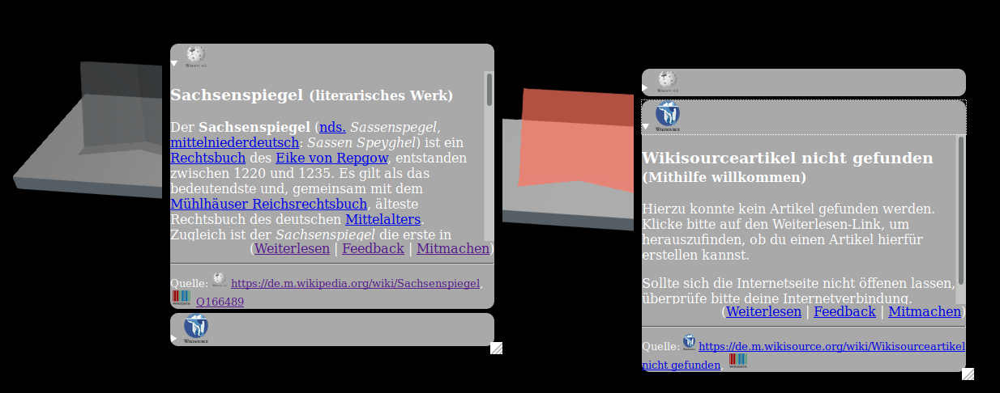
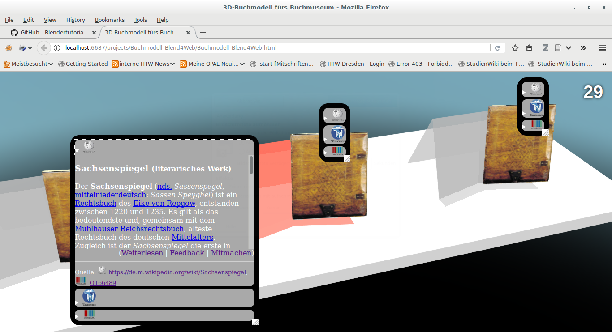

Buchmodell_Blend4Web
====================

Die gleichnamige Blenderdatei enthält eine Beispielanwendung des Bookholder-Unterprojektes. Es bietet einige interaktive virtuelle Buchstützen+Bücher mit Wikipedia/-source-Anbindung.

Voraussetzungen
---------------
* Blend4Web
* Internetverbindung

Verwendung
----------
* URLs für Wikipedia- und Wikisourceartikel sowie iFrame-Inhalt für Wikidata-Diagramm im Nodeeditor von Blender eintragen

@TODO: Bitte ergänzen.

Hinweise
--------
* Bugreports und Pullrequests willkommen ;-)
* Der Artikeltitel (Lemma) wird jeweils aus der Wiki-URL extrahiert ("http(s)://"<Domain>"/"<Lemma>"?"<Parameter>)
* Namenskonvention: Die Emptys haben genau wie ihr Bookholderobjekt, jedoch mit vorangestelltem "Empty_" zu heißen, damit sie programmiertechnisch zugeordnet werden können
* die Outline-Animation funktioniert leider nur über den Nodeeditor und nicht per Javaskript
* Der Glow-Effekt funktioniert leider nur sehr eingeschränkt und nicht dynamisch (und auch nicht per Java-Skript), weshalb als Workaround das Material der Buchstütze im Bedarfsfall rosa leuchtet.
