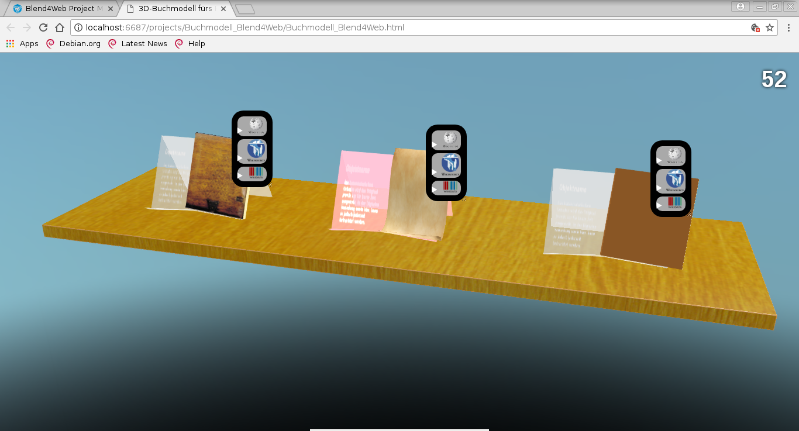

Buchmodell_Blend4Web
====================

Die gleichnamige Blenderdatei enthält eine Beispielanwendung des Bookholder-Unterprojektes. Es bietet einige interaktive virtuelle Buchstützen+Bücher mit Wikipedia/-source-Anbindung.

Voraussetzungen
---------------

Zum Anzeigen genügt ein einigermaßen moderner Webbrowser (WebGL1 + Java-Script benötigt; die Wiki-anbindung erfordert eine Internetverbindung). Zum Bearbeiten wird zudem noch folgendes benötigt:

* Blender 2.79
* Blend4Web 17.08

Verwendung
----------
* URLs für Wikipedia- und Wikisourceartikel sowie iFrame-Inhalt für Wikidata-Diagramm im Nodeeditor von Blender eintragen
* Infotextur für Buchstütze per Blender in Bookholder.blend eintragen

@TODO: Bitte ergänzen.

Hinweise
--------
* Bugreports und Pullrequests willkommen ;-)
* Der Artikeltitel (Lemma) wird jeweils aus der Wiki-URL extrahiert ("http(s)://"<Domain>"/"<Lemma>"?"<Parameter>)
* Namenskonvention: Die Emptys haben genau wie ihr Bookholderobjekt, jedoch mit vorangestelltem "Empty_" zu heißen, damit sie programmiertechnisch zugeordnet werden können
* die Outline-Animation funktioniert leider nur über den Nodeeditor und nicht per Javaskript
* Der Glow-Effekt funktioniert leider nur sehr eingeschränkt und nicht dynamisch (und auch nicht per Java-Skript), weshalb als Workaround das Material der Buchstütze im Bedarfsfall rosa leuchtet.

Lizenz
------

* Die 3D-Modelle und der von mir erstellte Quellcode stehen unter der Lizenz CC-BY-NC.
* Die meisten der Buchtexturen stammen, sofern ich sie nicht selbst erstellt habe, von der Wikiversity, wo sie unter der CC-BY-SA-Lizenz stehen.
* Die Rechte an Logos gehören ihren jeweiligen Rechteinhabern.

@TODO: Aufzählung vervollständigen.
